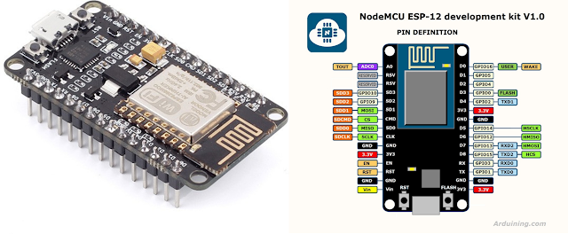

# esp8266 alarm

- Um alarme para porta desenvolvido com esp8266, pode ser armado e desarmado pela internet utilizando um broker mqqt, lembre de inserir suas informações no campos correspondentes antes de enviar o código para o esp8266.

>>

  
  

>>
